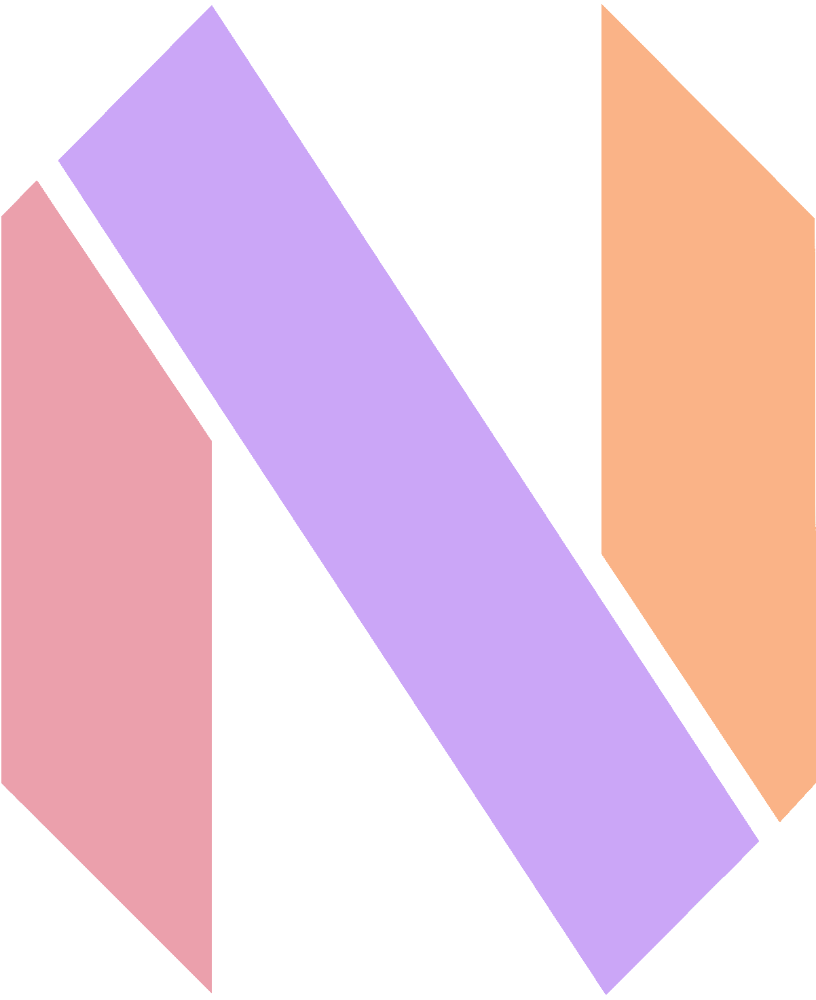

<div align="center">
    </img>


</img>

This is my go-to Neovim configuration for daily use.

</div>

## ✨ Features

- Standalone usability from anywhere via `nix run`.
- Home-manager integration.

## 🚀 Usage

```bash
nix develop

# Anywhere
nix run github:rgroemmer/neonix

# Local
nix run .

```

## 🏠 Home-manager

```nix
# add to inputs
neonix = {
  url = "github:rgroemmer/neonix";
  inputs.nixpkgs.follows = "nixpkgs";
};

# import module
imports = [
  inputs.neonix.homeManagerModules.neonix
];

# activate
programs.neonix = {
    enable = true;
};
```
